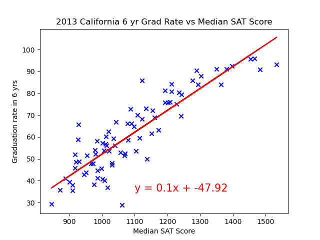

# Trends-in-Education
For this project we looked at graduation rates in the U.S over the past few years to find if different factors such as SAT scores, financial aid, and type of school affected rates.

After cleaning our [data](datacleaning.ipynb) using Pandas, we used a variety of graphs to help answer the following:
1. How many students in the U.S graduated each year from 2002 – 2013?
   - 2 line graphs and a horizontal bar chart were used to show graduation percentage for both 4 and 6 year graduates, total graduate rate, as well as the number of graduates.
   - 
   - 
   - 
2. What type of school has the average highest graduation rate from 2002 - 2013? Overall and for the selected state.
   - 2 bar charts showing rates for graduates in the U.S and Clifornia by type of school. 
   - 
   - 
3. What is the effect on graduation rates based on financial aid amount in California?
   - 2 Scatter plots with line regress for 4 and 6 year graduates. 
   - 
   - 
4. What is the effect on graduation rates based SAT scores in California?
   - 2 Scatter plots with line regress for 4 and 6 year graduates.
   - 
   - 
5. Does California have more 4 or 6 year graduates?
   - A pie chart showing the percentage of 4 and 6 year graduates in California for 2013.
   - 
